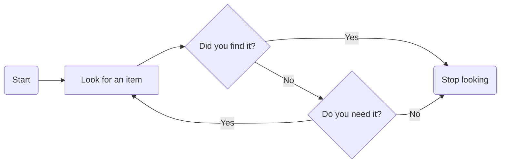
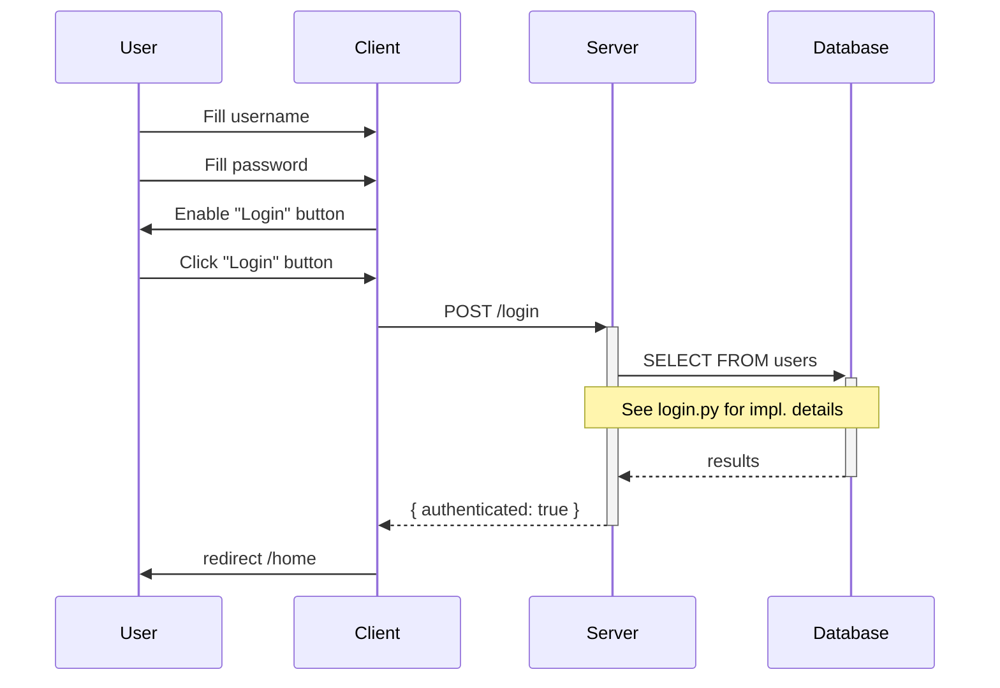
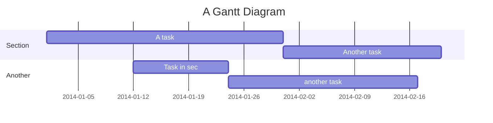

# Flowchart

```mermaid
graph LR
A(Start)
A --> B[Look for an item]
B --> C{Did you find it?}
C -->|Yes| D(Stop looking)
C -->|No| E{Do you need it?}
E -->|Yes| B
E -->|No| D
```

# Sequence diagrams

```mermaid
sequenceDiagram
participant U as User
participant C as Client
participant S as Server
participant DB as Database

U ->> C: Fill username
U ->> C: Fill password
C ->> U: Enable "Login" button
U ->> C: Click "Login" button
C ->>+ S: POST /login
S ->>+ DB: SELECT FROM users
Note over S,DB: See login.py for impl. details
DB -->>- S: results
S -->>- C: { authenticated: true }
C ->> U: redirect /home
```

# Gantt Diagram

```mermaid
gantt
    title A Gantt Diagram
    dateFormat  YYYY-MM-DD
    section Section
    A task           :a1, 2014-01-01, 30d
    Another task     :after a1  , 20d
    section Another
    Task in sec      :2014-01-12  , 12d
    another task      : 24d
```
